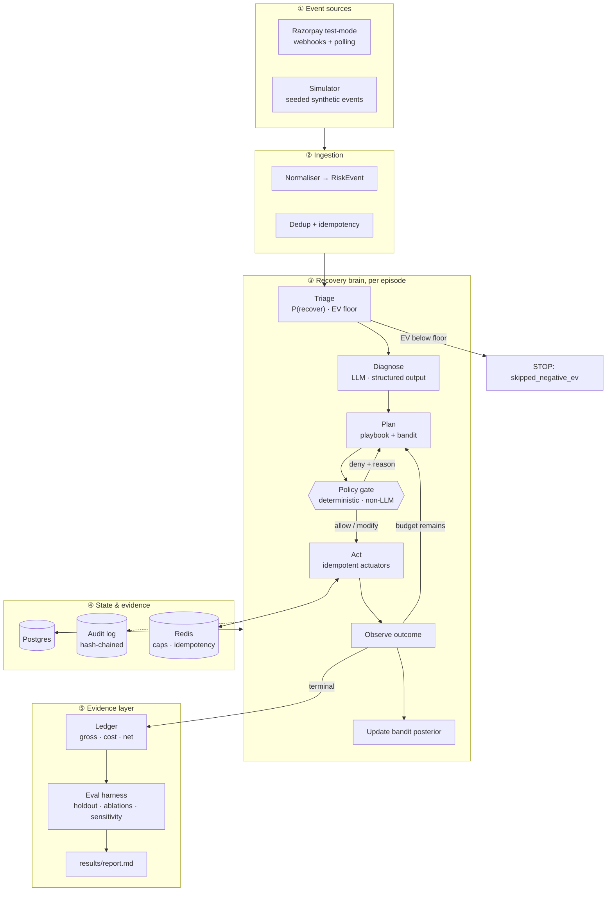
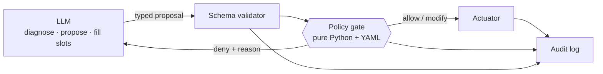
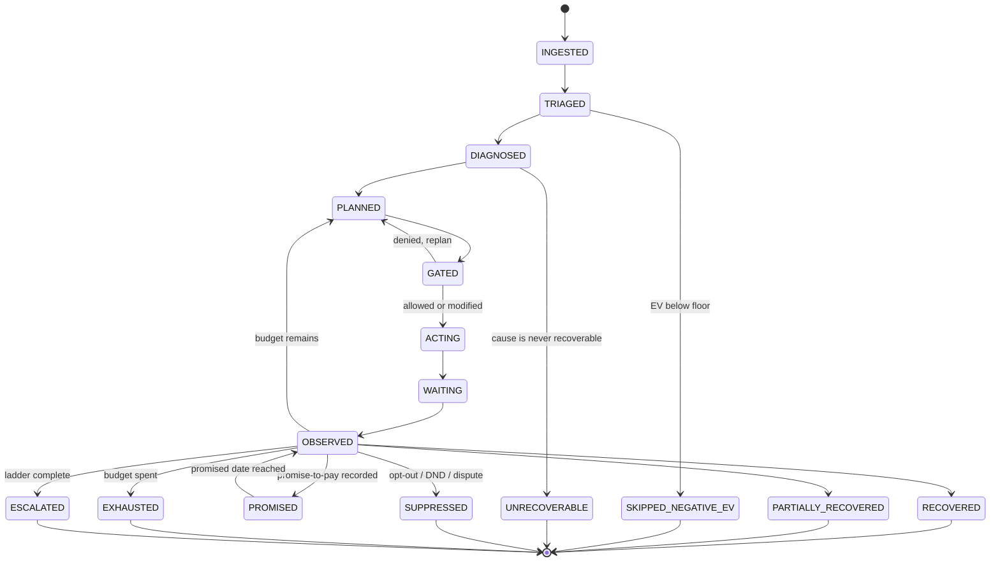
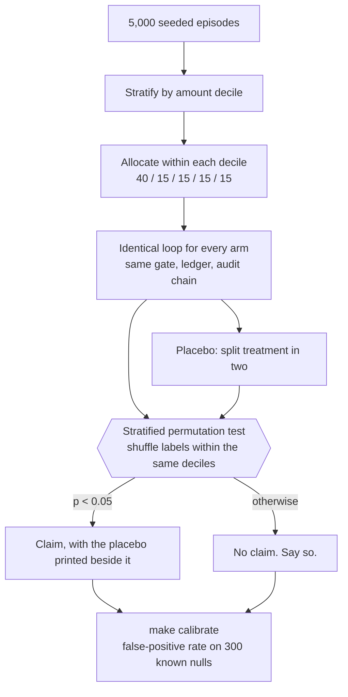

# Architecture

## The five-stage loop

```
DETECT  →  DIAGNOSE  →  DECIDE  →  EXECUTE  →  MEASURE
```



## The control-flow invariant: the LLM proposes, code disposes



Four rules, none of them negotiable:

1. **No LLM output reaches an actuator** without passing schema validation and
   then the policy gate.
2. **The policy gate contains no model call.** It is deterministic,
   property-tested, and diffable.
3. **Every gate decision — allow *and* deny — is logged with its reasons.**
4. **Every actuator is idempotent**, keyed on
   `sha256(episode_id | step_no | tool | canonical_args)`.

## Episode state machine

Eight terminal states. Each is a stopping rule; each is individually tested.
The transition table is data (`domain.VALID_TRANSITIONS`) and the engine refuses
any move not listed in it.



`SKIPPED_NEGATIVE_EV` is a feature, not an omission: the agent declining to
spend money on an episode that is not worth recovering is the system optimising
profit rather than activity.

## Trust boundaries

| Zone | May do | May never do |
|---|---|---|
| **LLM** | Classify into the closed taxonomy; propose typed actions; fill template slots | Execute anything; write free text to a customer by default; assert a ledger fact it has not read |
| **Schema validator** | Reject malformed proposals | Interpret intent |
| **Policy gate** | Allow, rewrite, or refuse any action | Call a model; perform I/O; be configured past an invariant |
| **Actuators** | Cause exactly one idempotent side effect | Run without a gate verdict |
| **Inbound customer text** | Be classified as data | Be treated as instructions — it is wrapped and marked untrusted |

## Time

Two clocks, one interface (`wapas.clock.Clock`).

`RealClock` is wall time. `VirtualClock` is a deterministic clock the simulation
drives forward: 90 days of retries, cooldowns, promise dates and invoice aging
compress into a few minutes of wall time, and the same seed always produces the
same sequence. Nothing outside `wapas.clock` may call `datetime.now()`, so an
evaluation run is fully determined by its seed and its scenario.

## Money

Every monetary amount is an **integer number of paise**. Floats never touch
money — not in the database, not in the domain model, not in the evaluation
harness. Rupees appear only at the presentation boundary, formatted with Indian
digit grouping (`₹1,23,456.78`).

## Audit

Append-only, hash-chained:

```
hash = sha256(prev_hash ‖ seq ‖ iso8601(at) ‖ canonical_json(payload))
```

`seq` and the timestamp are inside the commitment, so entries cannot be
reordered or back-dated undetected. Verification (`verify_chain`) catches a
mutated payload, a mutated timestamp, a deleted entry, a reordered entry and a
forged hash. Postgres additionally rejects `UPDATE` and `DELETE` on the table
with a trigger, so the guarantee does not rest on application code behaving.

Payloads store salted digests in place of personal data, so the chain proves
what happened to whom without becoming a copy of the customer database.

## How a claim gets made

The evaluation is the product, so its design is architecture rather than
tooling.



Four properties this buys, each of which was added because something went
wrong without it:

**Every arm runs identical code.** Control, baselines and agent pass through
the same gate, ledger, attribution and audit chain. Only the strategy differs,
so a measured difference cannot be an artefact of the harness.

**The harness never reads ground truth.** It did once — the action window was
derived from the true root cause, handing every arm an oracle-derived stopping
rule (D20). A regression test now asserts a cause-blind strategy behaves
identically whatever the cause is.

**The p-value decides, the interval describes.** A percentile bootstrap on a
heavy-tailed difference of means is approximate; a permutation test under the
randomisation actually performed is exact.

**A null control is published beside every claim.** The treatment arm is split
in two and the harness is asked to distinguish halves that ran identical code.
Whatever it reports there is the noise floor.

## Repository layout

```
policies/          contact.yaml, money.yaml, escalation.yaml  ← the guardrails, as data
config/rates.yaml  channel + model rate card (pinned FX)      ← reproducible costs
src/wapas/
  money.py         integer paise, INR formatting
  clock.py         Clock protocol, VirtualClock, VirtualScheduler
  domain.py        closed enums, taxonomy, dispositions, transition table
  audit/           hash chain, canonical JSON, redaction, verification
  policy/          the gate — no model calls, mypy --strict
  ingest/ triage/ diagnose/ plan/ actuators/ engine/ ledger/ api/
sim/               seeded populations, published generative parameters
eval/              batch runner, baselines, ablations, sensitivity, bootstrap CIs
redteam/           20 adversarial scenarios
tests/             unit + property tests
results/           report.md and charts, regenerated by CI
```

## Rejected alternatives

| Rejected | Reason |
|---|---|
| Temporal / Airflow | A second infrastructure system to explain. Our state machine is ~400 lines and its transparency is a selling point. |
| LangGraph | Its checkpointing would need explaining anyway, and we want the state machine to be readable in one sitting. Acceptable fallback if the schedule slips. |
| Vector DB / RAG | No corpus needs it. Adding one would be résumé-driven development. |
| Multi-agent framework | The problem is a bounded pipeline, not open-ended exploration. One agent with tools plus deterministic orchestration is the right altitude — and cheaper to prove correct. |
| Fine-tuning | No labelled data, and a 15-member closed taxonomy is well within prompted classification with structured output. |
| Floats for money | A rounding error in the one number the project is judged on. |
| Streamlit for the dashboard | Faster to build, but the dashboard carries the five-minute video. |
